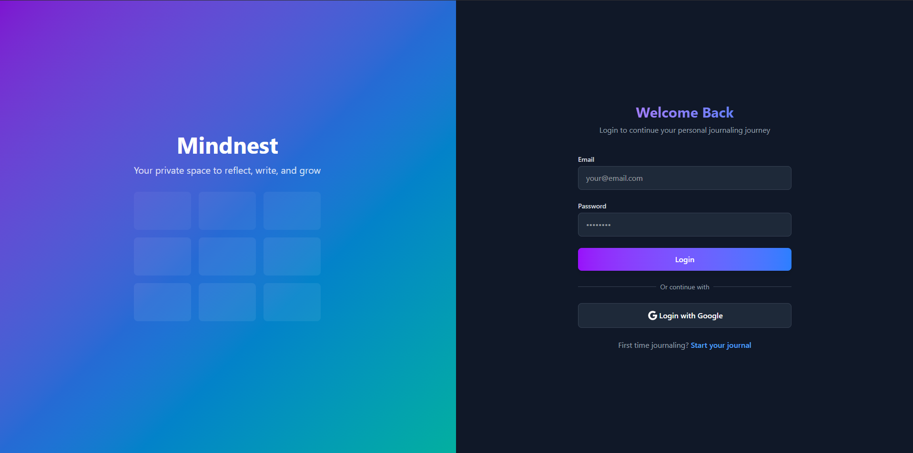
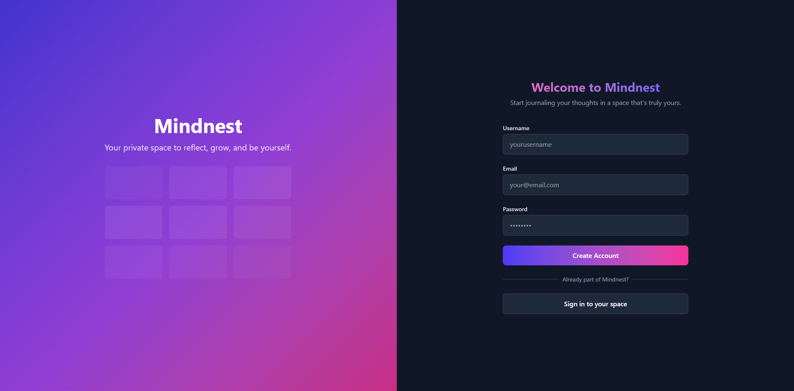
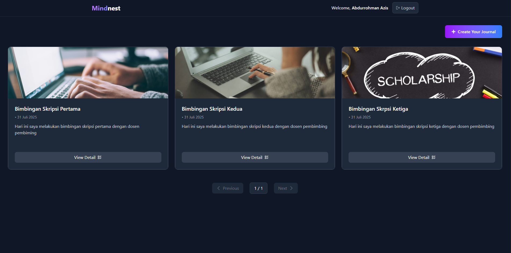
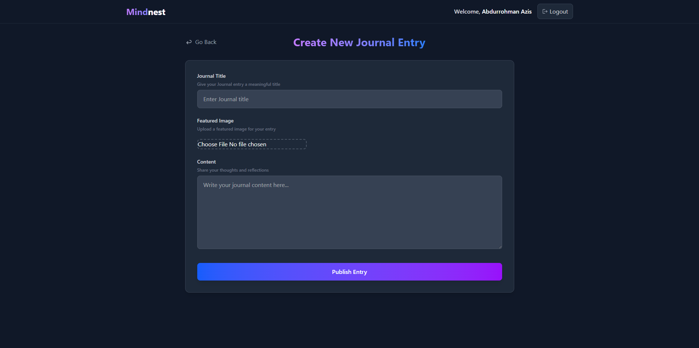
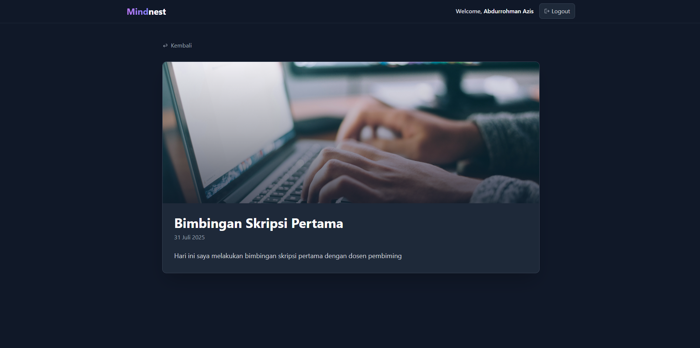
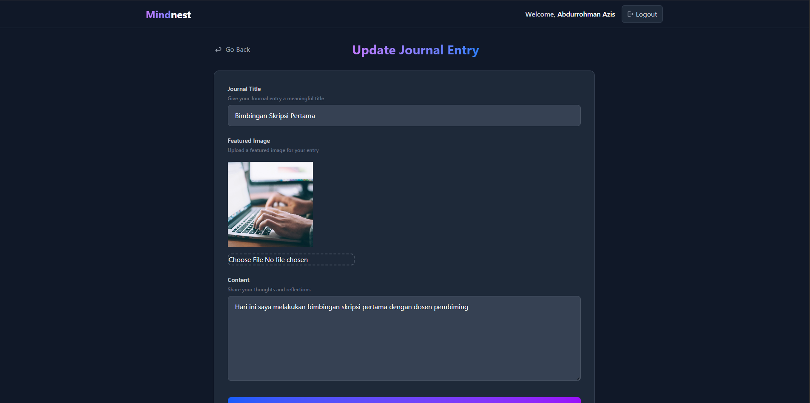
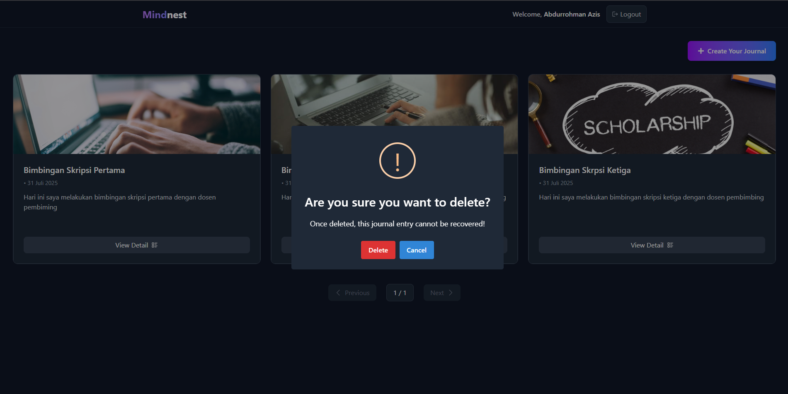

# 🧠 MindNest — Your Digital Journaling Sanctuary

**MindNest** is a full-stack journaling application designed to help users express their thoughts, reflect on their day, and grow through mindful writing. Built using the powerful **MERN stack** (MongoDB, Express.js, React, Node.js), MindNest provides a calm, distraction-free environment for journaling anytime, anywhere.

## ✨ Features

- 📝 **Journal Entry Management**  
  Easily create, edit, and delete your personal journal entries with a clean and intuitive interface.

- 🔒 **Secure Authentication**  
  Protect your privacy with JWT-based authentication and optional login with Google OAuth.

- 🎨 **Dark Mode Friendly**  
  A soothing, dark-themed UI designed for long writing sessions, day or night.

## 🔧 Tech Stack

- **Frontend:** React, Redux, React Router
- **Backend:** Node.js, Express.js
- **Database:** MongoDB, Mongoose
- **Authentication:** JWT, Google OAuth
- **Styling:** TailwindCSS

## 🧭 How to Use

- Register a new account or log in using Google.
- Begin writing your daily journal entries.
- Edit or delete past entries anytime.
- All entries are securely stored and accessible only to you.

## 💻 Features Page

### - Login Page with Auth Google

### - Login Register

### - Home Page

### - Create Journal

### - Detail Journal

### - Edit Journal

### - Delete Journal

## 🤝 Contributing

Want to contribute to MindNest?  
We welcome suggestions, bug reports, and feature ideas.  
Please fork the repo, make your changes, and submit a pull request.

## 📬 Contact

Have feedback or questions?  
Reach out at [abdurrohmanazis@gmail.com](mailto:abdurrohmanazis@gmail.com).

